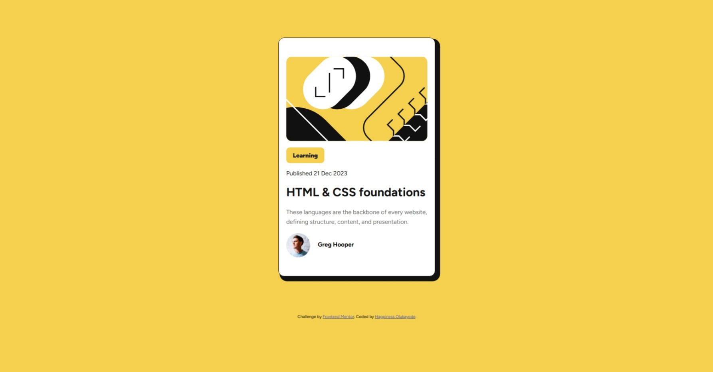

# Frontend Mentor - Blog preview card solution

This is a solution to the [Blog preview card challenge on Frontend Mentor](https://www.frontendmentor.io/challenges/blog-preview-card-ckPaj01IcS). Frontend Mentor challenges help you improve your coding skills by building realistic projects.

## Table of contents

- [Overview](#overview)
  - [The challenge](#the-challenge)
  - [Screenshot](#screenshot)
  - [Links](#links)
- [My process](#my-process)
  - [Built with](#built-with)
  - [What I learned](#what-i-learned)
  - [Continued development](#continued-development)
- [Author](#author)

## Overview

### The challenge

Users should be able to:

- See hover and focus states for all interactive elements on the page

### Screenshot



### Links

- Solution URL: [https://github.com/uptowngirl757/blog_preview_card/blob/main/index.html](https://github.com/uptowngirl757/blog_preview_card/blob/main/index.html)
- Live Site URL: [https://uptowngirl757.github.io/blog_preview_card/](https://uptowngirl757.github.io/blog_preview_card/)

## My process

### Built with

- Semantic HTML5 markup
- CSS custom properties
- Flexbox

### What I learned

I learned how to align text on same line by wrapping them in a container so they look left-aligned without much stress and also aligning text and imgs using the vertical-align property

```css
.user-info img {
  vertical-align: middle;
}
```

### Continued development

I want to get better at using the `position: relative` and other position properties and also understanding containers and using them right.

## Author

- Frontend Mentor - [@uptowngirl757](https://www.frontendmentor.io/profile/uptowngirl757)
